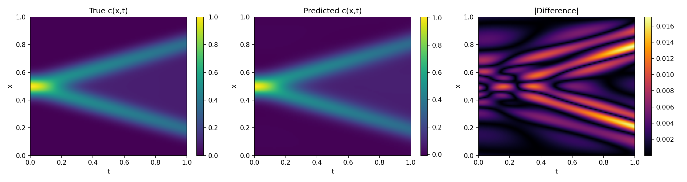
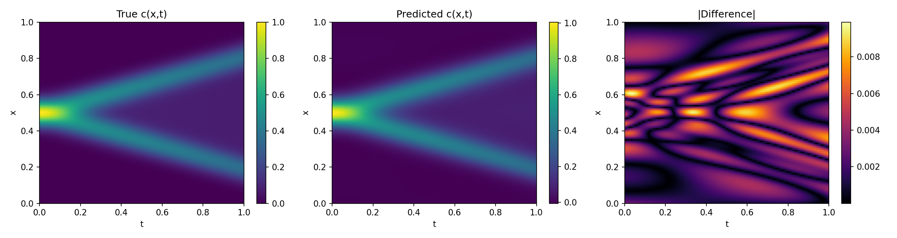
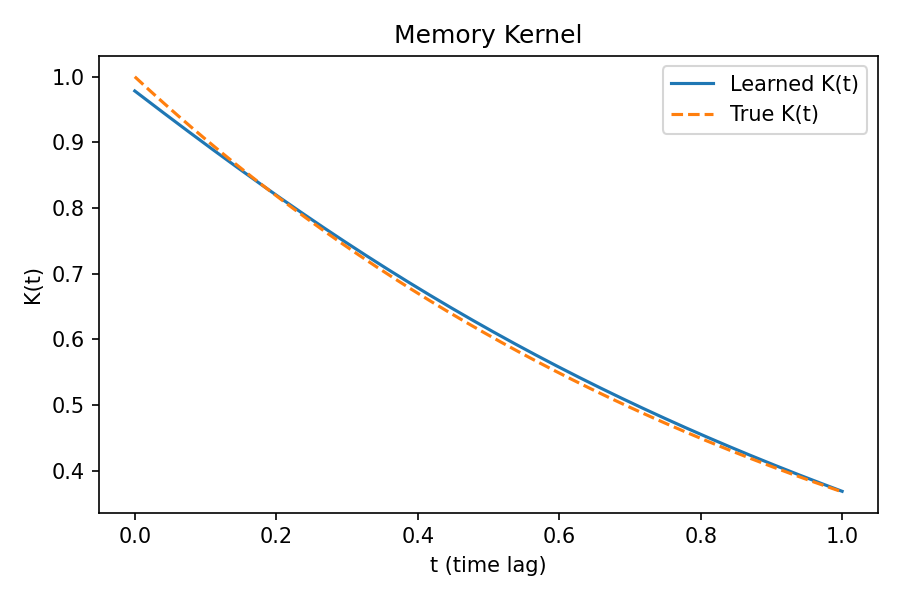

# Memory-Aware Physics-Informed Neural Networks for Non-Markovian Diffusion

A from-scratch PyTorch implementation of a Physics-Informed Neural Network that solves the memory-integral diffusion equation

$$\partial c/\partial t(x,t) = \int_0^t K(t-s) · D · ∇²c(x,s) ds$$

learning both the concentration field $c(x,t)$ and the memory kernel $K(Δt)$ jointly from sparse, optionally noisy observations. The project favors clarity over performance: 1D domain only, hand-rolled trapezoidal quadrature, synthetic ground truth, and no external PINN libraries. Every derivative comes from `torch.autograd` and every integral is a plain discrete convolution.

---

## Background

Ordinary diffusion is Markovian: the rate of change at time $t$ depends only on the instantaneous curvature of the field, $∂c/∂t = D·∂²c/∂x².$ Many real systems suchas porous media, viscoelastic transport, intracellular trafficking, show memory effects, where past states continue to influence the present. The memory kernel $K(t-s)$ encodes how strongly the past matters; if $K(t) = δ(t)$ the equation reduces to ordinary diffusion. This project uses the exponential kernel $K(t) = e^{-t}$ as ground truth, while a second network is free to learn an arbitrary kernel shape from data.

---


## Running

```bash
python training/train_baseline.py
# or
python training/train.py
```

Custom runs:

```python
from training.train import run_experiment

results, pinn, kernel_net = run_experiment(
    name="my_run",
    learn_kernel=True,
    obs_fraction=0.15,
    noise_std=0.0,
    D=0.01,
    Nx=61, Nt=61,
    epochs=5000,
    lr=1e-3,
    device="cpu",
)
print(results["mse"], results["relative_l2"], results["kernel_rel_l2"])
```


```bash
python training/train_baseline.py

python training/train.py
```

## details  of files

1. **`data/generate_data.py`** produces ground truth with a plain explicit
   finite-difference scheme. For the memory equation, the same trapezoidal
   rule used later inside the PINN is used to build the solution,
   so the FD data is a target for the PINN to reproduce.

2. **`models/pinn.py`** and **`models/kernel_network.py`** are two small,
   independent feed-forward networks and they only interact through the loss.

3. **`physics/quadrature.py`** implements the memory integral as a discrete
   convolution over a shared time grid, using the trapezoidal rule.

4. **`physics/diffusion.py`** uses `torch.autograd` to calculate derivatives and $c(x,t)$
5. **`physics/losses.py`** loss functions of different kind. Data, boundary conditions, Initial condition, physics due to diffusion eq.

6. **`training/trainer.py`** runs training and produces plots.

# Some results
> Fixed kernel case: Comparison between the ground truth and the model predictions. 
<p align="center">
  
</p>

> Kernel learning case: The model learns the kernel simultaneously while fitting the data. The predicted results closely match the ground truth, and the learned kernel accurately recovers the target kernel, as shown below.
<p align="center">
  
</p>
<p align="center">
  
</p>

## Extending this project

- Learning power law kernel (Observed in many real life situations)
- Here the particle diffuses in free space, what about diffusion in a potential?
Can PINN learn what kind of potential particle is subjected to?